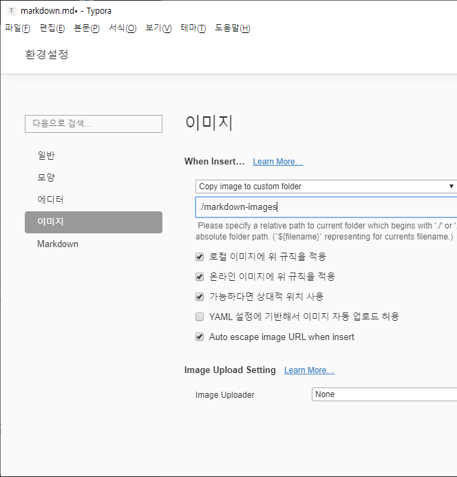

# 마크다운 문법 정리

## 제목(heading)


제목은 `#`의 갯수를 통해서 작성함

제목을 잘 작성하면 Overview또는 목차로 활용

### 제목3

#### 제목4 < #*4

##### 제목5 < #*5

###### 제목6  < #*6

## 목록

* 순서가 없는 목록
* `*` 로 동그라미 모양을 만듬


* `tab`을 누르면 하위 목록으로 작성 가능
  * 이렇게됨 (`tab` 눌렀을 때)

* `shift` + `tab`을 누르면 상위 목록 레벨 작성

1. 순서가 있는 목록은
2. `1.`로 시작하면 된다.
   1. 똑같이 `tab`을 누르면 하위 목록 작성
   2. 싫을 땐 `shift` + `tab` 사용
   3. `*`를 섞어서 사용 가능
      * `*`을 눌렀을 때

## 코드블록 ( `* 3 + lang name)

``` python
for i in range(30):
    print('*', end='')
    if i == 5:
        print('\n')
```

``` C
#include <stdio.h>
void main{
    
    int a, b, c;
    a = 0;
    b = 3;
    c = 17;
    
    printf('%d', a)
   }
```


### 인라인 코드블록 ( ` * 1  )

인라인 코드 블록은 아래와 같이 활용될 수 있다.

본 프로젝트는 `tensorflow`를 활용하였습니다.

출력을 하기 위해서는 `print` 함수를 활용


## 텍스트 기타 문법

*강조(기울임)*  >  * * 사이에 글자

**강조(굵게)** > ** ** 사이에 글자


## 링크

[구글](http://google.co.kr)

`[`, `]` 로 표제어를 감싸고, `(`, `)`를 통해 하이퍼링크 추가

ex) [ 구글 ] ( google.com )


## 이미지

* 기본 설정으로 이미지를 가져오면 '절대 경로'로 표기됨 
  * ex. C:\ ~~~~
* 이 경우, Github나 다른 컴퓨터에서는 깨질 수 있음
* 때문에 아래의 설정이 필요
  * 아래와 같이 작업 해야함 (파일 > 환경설정)
  * 'markdown-images' 폴더에 이미지를 복사 / 그걸 업로드



## 표

| 순번 | 이름   |
| ---- | ------ |
| 1    | 홍길동 |
| 2    | 도레미 |

